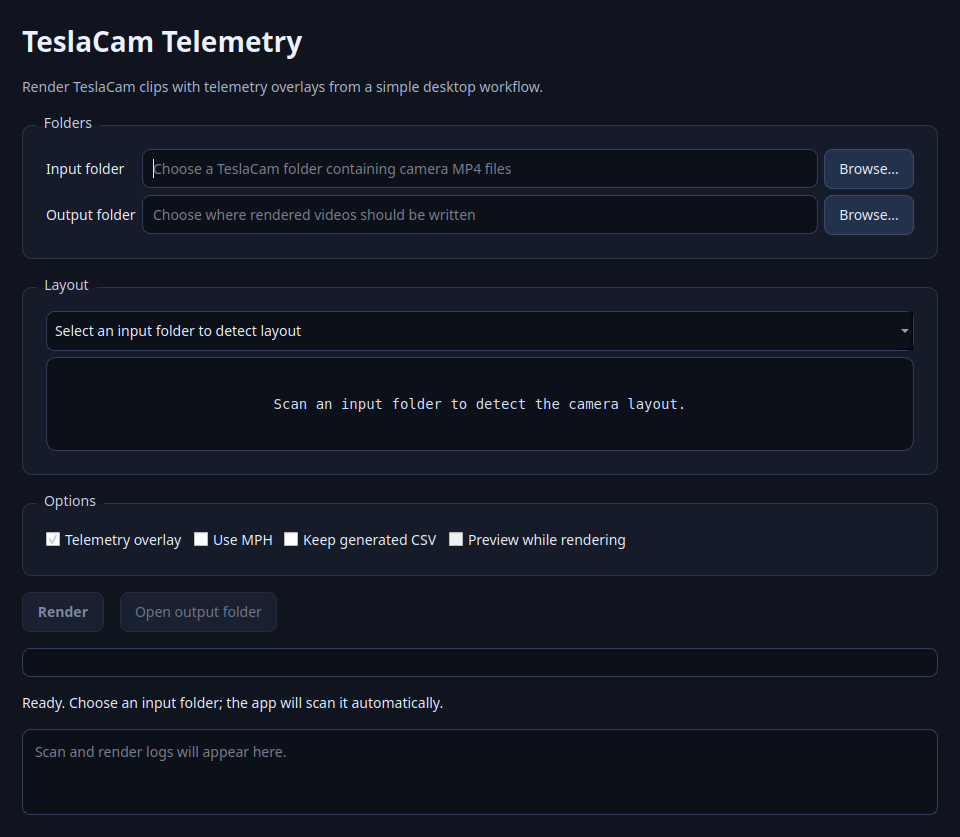

# TeslaCam Telemetry

Processes TeslaCam MP4 files and accompanying CSV telemetry files to produce a combined multi-camera video with real-time telemetry overlay.

This is an unofficial community project and is not affiliated with, endorsed by, or supported by Tesla.

---

## Features
* **Multi-cam Sync**: Automatically stitches four-camera and six-camera TeslaCam clips into a single frame.
* **Batch Processing**: Ability to add multiple sets of clips to be processed into one large video automatically in order of timestamp.
* **Telemetry Overlay**: Real-time visualization of:
	* Speed
	* Gear selection
	* Steering wheel angle
	* Turn signal state
	* Accelerator pedal position
	* Brake pedal state
	* Self driving state

## Layout


## Prerequisites
1. **Python 3.11+**: Check version with `python --version` in a terminal window.
2. **MP4 codec support**: OpenCV needs MP4 encoding support to write the output video. Installing FFmpeg is recommended if MP4 output fails.

## Installation

1. **Clone this repository**:
   ```bash
   git clone https://github.com/JeandreRoux/teslacam-telemetry.git
   cd teslacam-telemetry
   ```

2. **Create a virtual environment**:
   ```bash
   python -m venv .venv
   ```

3. **Activate the virtual environment**:

   **macOS/Linux**:
   ```bash
   source .venv/bin/activate
   ```

   **Windows**:
   ```powershell
   .venv\Scripts\activate
   ```

4. **Install the app**:
   ```bash
   python -m pip install .
   teslacam-telemetry --help
   teslacam-telemetry-ui --help
   ```

   To update an existing normal install after pulling new code:
   ```bash
   git pull
   python -m pip install --upgrade .
   teslacam-telemetry --help
   teslacam-telemetry-ui --help
   ```

   To uninstall the app:
   ```bash
   python -m pip uninstall teslacam-telemetry
   ```

   For development, install in editable mode instead:
   ```bash
   python -m pip install -e .
   ```

5. **Install FFmpeg (if needed)**:

   **Windows**:
   ```powershell
   winget install ffmpeg
   ```

   **macOS**:
   ```bash
   brew install ffmpeg
   ```

   **Linux (Ubuntu/Debian)**:
   ```bash
   sudo apt update && sudo apt install ffmpeg
   ```

## Input Files

The app auto-detects the available TeslaCam camera set and selects the matching default layout.

Four-camera set:

```text
YYYY-MM-DD_HH-MM-SS-front.mp4
YYYY-MM-DD_HH-MM-SS-back.mp4
YYYY-MM-DD_HH-MM-SS-left_repeater.mp4
YYYY-MM-DD_HH-MM-SS-right_repeater.mp4
```

Six-camera set additionally includes the pillar cameras:

```text
YYYY-MM-DD_HH-MM-SS-left_pillar.mp4
YYYY-MM-DD_HH-MM-SS-right_pillar.mp4
```

Each timestamp in a batch must use the same complete camera set. Mixed four-camera and six-camera batches are rejected so the output layout does not change mid-video.

Telemetry can be read from embedded SEI data when available. You can also provide a matching CSV manually:

```text
YYYY-MM-DD_HH-MM-SS.csv
```

## Encrypted Dashcam Clips

Tesla software update 2026.20 introduced optional dashcam and Sentry Mode video encryption. If your clips are encrypted, this tool will not be able to read them directly.

Before running this program, decrypt the clips using Tesla's official Dashcam web tool:

```text
https://dashcam.tesla.com
```

After decrypting, use the exported/decrypted MP4 files as your input files.

You can also disable dashcam encryption in the vehicle under `Controls > Safety > Encrypt Dashcam Recordings`, if you prefer to keep future clips unencrypted.

## Usage

### Desktop app

For most users, the desktop app is the easiest way to render TeslaCam footage:

```bash
teslacam-telemetry-ui
```



The desktop app provides a simple workflow:

1. Choose the TeslaCam input folder containing the camera MP4 files.
2. The app automatically scans the folder and detects the camera set.
3. Choose an output folder.
4. Select render options:
   * **Telemetry overlay**: Adds speed, gear, steering, pedal, and driving-state data when telemetry is available.
   * **Use MPH**: Shows speed in MPH instead of KM/H.
   * **Keep generated CSV**: Keeps telemetry CSV files generated from embedded SEI metadata.
5. Click **Render**.
6. When rendering completes, click **Open output folder** to view the finished video.

The app does not choose a layout when it first opens. After you select an input folder, it scans the footage and auto-selects the matching layout:

* **Four-camera standard** for front, back, left repeater, and right repeater clips.
* **Six-camera grid** for front, back, repeaters, and pillar-camera clips.

You can also prefill folders from the command line:

```bash
teslacam-telemetry-ui --input /path/to/teslacam/clips --output /path/to/save/video
```

### Command line

1. **Run the app**
   ```bash
   teslacam-telemetry --input /path/to/teslacam/clips --output /path/to/save/video
   ```

2. **Optional Arguments**
* `--no-overlay`: Disables the telemetry overlay and only produces the multi-camera stitched video.
* `--mph`: Sets the speed units to MPH. Default is KM/H.
* `--preview`: Enables render preview while videos are being processed. Will cause processing to take slightly longer.
* `--keep-csv`: Keeps generated `csv` data file, instead of just deleting it after use.

## Future Roadmap
The long-term direction is to make TeslaCam Telemetry a simple, reliable utility for turning raw TeslaCam folders into polished multi-camera videos without requiring Python or command-line knowledge.

Planned priorities:

* **Windows Executable**: Provide a packaged `TeslaCam Telemetry.exe` / portable ZIP so non-technical users can download, extract, and run the app without installing Python manually.
* **Smarter Desktop Workflow**: Add drag-and-drop input, clearer scan summaries, and stronger preflight validation for missing clips, mixed camera sets, and telemetry availability before rendering starts.
* **Layout Options**: Add a friendly layout selector with generic names such as **Four-camera standard**, **Six-camera grid**, **Front focus**, and **Balanced grid**, avoiding hardware-specific labels in the UI.
* **Clip Group Selection**: Show detected timestamp/event groups so users can render all clips, selected clips, a time range, or separate outputs per event.
* **Render Presets**: Provide simple output-quality choices such as fast preview, standard quality, high quality, and smaller shareable files.
* **Progress, Cancel, and Logs**: Improve long-render feedback with current clip/frame progress, safe cancellation, and shareable troubleshooting logs.
* **Telemetry Overlay Presets**: Offer cleaner overlay styles such as minimal, detailed, and video-only, with more control over which telemetry fields are shown.

## Known Limitations
* Mixed four-camera and six-camera batches are not rendered together in one output; each batch must use one complete camera set.
* Telemetry overlays depend on SEI metadata or a matching CSV file being available.
* Some clips may contain missing or partial telemetry, especially when the car is parked.
* MP4 output depends on OpenCV having working codec support on your system.

## Troubleshooting
* Not all Tesla-generated dashcam clips contain SEI data. Only clips recorded on Tesla firmware 2025.44.25 or later and HW3 or above contain SEI data. If car is parked, SEI data may not be present.
If no SEI metadata is found, ensure your dashcam footage meets these requirements.
* If there is an error with data extraction and you meet the SEI data requirements above, you can extract the data manually via the [Tesla SEI Explorer](https://teslamotors.github.io/dashcam/sei_explorer.html) and place the `csv` file in the input directory before starting the program.

## Attribution
The SEI extraction logic in `modules/sei_extractor.py` is adapted from Tesla-provided dashcam SEI extraction code and has been modified for use as part of this project.
